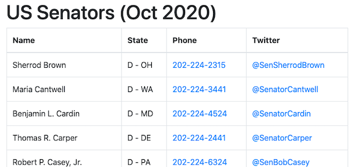

# Problem: Senators

In this exercise, you will practice creating simple React components using JSX. Specifically, you will create a simple page displaying a list of US Senators (as of Oct 2020&mdash;pre-election) and how you can contact them to complain:



(Note that the above example may have an out-of-date title)

## Running the Program
Because this app is created with React (and scaffolded through [Create React App](https://github.com/facebook/create-react-app)), you will need to install dependencies and run a developer web server in order to transpile and view the application. You can run this server by using the command:

```bash
# from inside the `problem-a/` folder
cd path/to/problem-a

# install dependencies for react
npm install  # only once

# run the server
npm start
```

You can then view the rendered page _in a web browser_. Remember to check the Developer console for any errors!

## Exercise Instructions
To complete the exercise, edit the included **`src/App.js`** and **`src/index.js`** files and add in the required code. Note that you should ___not___ need to edit any of the other provided files (including `index.html`).

(To make testing easier and more consistent, you will be defining all components for your App inside of the `App.js` module, as opposed to organizing them into separate modules as you would in a larger system).

1. In the **`App.js`** file, implement and `export` a new React component called **`App`**. This component function should return a `<div>` element with the `container` CSS class. The `<div>` should have a child `<h1>` element with the content `"US Senators (Oct 2020)"`.
  
    - _Use JSX to define these DOM elements!_ 

    - Remember that you specify CSS classes on React components using the `className` attribute.

    - **Important** Make sure to `export` this component function, so that it is available to render (and to the tester).

2. In the **`index.js`** file, import the `App` component from `./App` (import it by name in `{}`; it is not a default export!) Then use the `ReactDOM.render()` function to render an instance of the `App` component into the HTML-provided `#root` element. This should cause your heading to appear in the served page.

3. In the **`App.js`** file, implement and `export` a new React component called **`SenatorTable`** that will represent the data table of Senators. This component function should return a `<table>` element with the CSS classes of `table` and `table-bordered` (for Bootstrap styling).

    Modify the `App` component so that it also returns an instance of the `SenatorTable` component inside of the `<div>` (after the heading). _Use JSX to do this_.

    You can check that this works by _inspecting_ the rendered DOM In the browser to see that the table is included (though the table will have no content yet).

4. Next, implement and `export` a new React component called **`TableHeader`** that will represent the heading row for _any_ table (not just this one!). This component should expect a `prop` called **`columnNames`** that is an _array_ of column names (as Strings). The component should render a `<thead>` (table head) element containing a `<tr>` (table row). Inside the `<tr>` should be a set of `<th>` (table heading) elements, one for each String in the `columnNames` prop.

    Use the `.map()` function to convert the `columnNames` prop into an array of `<th>` DOM elements (using JSX and _inline expressions_), and then include this array in the returned DOM elements.

    - Be sure to give each `<th>` element a `key` attribute (the column name string is a fine value) so that React can keep track of it.

    Include an instance of the `TableHeader` component in the DOM returned by the `SenatorTable` component (as a child of the `<table>`). The `SenatorTable` component should pass the `TableHeader` it creates a `columnNames` prop that is the array `['Name', 'State', 'Phone', 'Twitter']` (defining this array as a separate variable is good practice).

    This should cause the heading row to appear in the table (with the correct 4 columns).

5. Implement and `export` a new React component called **`SenatorRow`** that will represent a row in the table for a Senator. This component should expect a `prop` called **`senator`**, which is an object with properties detailing the Senator (such as those found in the the `EXAMPLE_SENATORS` array). The component should render a new table row (`<tr>`), which has four table cells `<td>` elements:

    - One cell whose content is the Senator's `name`.
    - One cell whose content is the Senator's `state` and the first letter of the Senator's `party`. For example: `"D - WA"`.
    - One cell whose content is the Senator's phone number. This cell should include an `<a>` element whose `href` refers to the phone number with the `tel:` protocol (so that you could click on the link to dial on a mobile device). _Use an inline expression to construct the `href` string!)_
    - One cell whose content is the Senator's `twitter` account. This cel should also include an `<a>` element whose `href` refers to a URL of the format `https://twitter.com/user_name` (replacing `user_name` with the Twitter handle). The displayed text of the link should include an `@` in front of the twitter handle.

6. Modify the `SenatorTable` component so that it maps the provided `EXAMPLE_SENATORS` array to an array of `<SenatorRow>` objects, and then includes this array in the returned `<table>` (below the `<TableHeader>`). This should cause your table to now show two Senators and their information.

    - You must also put the `<SenatorRow>` array inside of a `<tbody>` element (inside of the `<table>`) to produce a valid DOM tree.

    - Remember to give each `<SenatorRow>` object a `key` attribute (e.g., of the Senator's id or name) so that React can keep track of them.

7. To show the entire table of Senators, go back to **`index.js`** and add an `import` statement to import the `senators.json` file (use the same syntax as a _default import_, e.g., `import ____ from ____`).

    Modify the `App` component so that it expects a prop **`senators`** that is an array of objects representing Senators. You should pass in the imported array when the `App` is instantiated (e.g., in the `React.renderDOM()` call in `index.js`). 
    
    Then modify the `SenatorTable` component so that it _also_ expects a prop `senators` that is an array of objects representing Senators. The `App` component should pass its `senators` prop to the instantiated `<SenatorTable>` object. The `SenatorTable` component should then use this prop (instead of `EXAMPLE_SENATORS`) to create the array of `<SenatorRow>` components.

    Once this value is passed down correctly, you should be able to see the entire list of 100 US senators! Then call them and tell them what to do.
